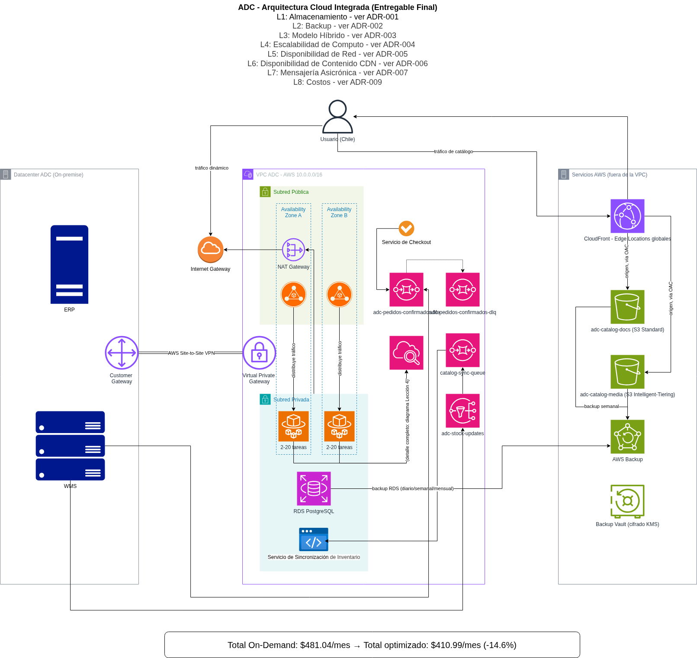

# Andes Digital Commerce (ADC): Arquitectura Cloud Conectada

> Proyecto ABP · Módulo 5 · Arquitecturas Cloud Básicas · SOFOFA

## 📌 Contexto

Andes Digital Commerce (ADC) es un retailer de e-commerce y logística que opera
en Chile, Perú y Colombia. Su plataforma de venta online enfrenta picos de
tráfico de 10-20x lo normal durante eventos tipo *CyberDay*, mientras que su
ERP y sistema de gestión de bodega (WMS) permanecen on-premise por
integraciones contractuales con proveedores logísticos locales.

Este proyecto documenta el diseño de una arquitectura cloud que resuelve, de
forma conectada e integral, los siguientes desafíos:

- Almacenamiento escalable del catálogo de productos
- Respaldo y recuperación de datos transaccionales
- Un modelo de nube híbrido justificado por la realidad del negocio
- Escalabilidad automática de cómputo para absorber picos de demanda
- Alta disponibilidad de la aplicación en múltiples zonas
- Distribución eficiente de contenido en 3 países
- Integración asíncrona entre servicios (pedido → pago → bodega)
- Estimación y control de costos en un modelo de tráfico altamente variable

## 🖼️ Diagrama de arquitectura

Diagramas individuales por componente (`diagrams/src/01-...` a `08-...`) y el
diagrama editable integrado están disponibles en [`diagrams/`](diagrams/).

## 🗂️ Estructura del repositorio

| Carpeta | Contenido |
|---|---|
| `docs/` | Informe técnico y costos por cada una de las 8 lecciones del módulo |
| `adr/` | Architecture Decision Records — una por cada decisión arquitectónica clave |
| `diagrams/src/` | Diagramas editables (.drawio) por etapa y el diagrama integrado final |
| `diagrams/export/` | Diagramas exportados (.png) |
| `costos/` | Estimaciones consolidadas vía AWS Pricing Calculator |
| `entregable-final/` | Documento integrador y esquema de comunicación entre servicios |

## 🧭 Cómo navegar este proyecto

1. Empieza por `docs/00-contexto-negocio/` para entender el negocio y sus requisitos.
2. Cada carpeta `docs/0X-.../` corresponde 1:1 a una lección del módulo, y enlaza
   su(s) ADR(s) correspondiente(s) en `adr/`.
3. `entregable-final/documento-consolidado.md` integra todo el diseño en una
   sola narrativa, con el diagrama final embebido.

## ☁️ Servicios AWS utilizados

| ADR | Componente | Servicios AWS |
|---|---|---|
| [ADR-0001](adr/0001-tipo-almacenamiento-objetos.md) | Almacenamiento de objetos | Amazon S3 (buckets `adc-catalog-media`, `docs`), URLs firmadas |
| [ADR-0002](adr/0002-estrategia-backup-recuperacion.md) | Backup y recuperación | RDS Multi-AZ (PostgreSQL), AWS Backup, Backup Vault (KMS) |
| [ADR-0003](adr/0003-modelo-nube-publica-privada-hibrida.md) | Modelo de nube híbrida | VPN Site-to-Site, subredes privadas (integración WMS/AD on-premise) |
| [ADR-0004](adr/0004-auto-scaling-computo.md) | Auto-scaling de cómputo | ECS Fargate, Auto Scaling, CloudWatch |
| [ADR-0005](adr/0005-balanceo-carga-multi-az.md) | Balanceo de carga / red | Elastic Load Balancing (ALB), Internet Gateway, NAT Gateway |
| [ADR-0006](adr/0006-cdn-distribucion-contenido.md) | CDN / distribución de contenido | Amazon CloudFront, Origin Access Control (OAC) |
| [ADR-0007](adr/0007-mensajeria-asincrona-colas.md) | Mensajería asíncrona | Amazon SQS (FIFO + Dead Letter Queue), Amazon SNS |
| [ADR-0008](adr/0008-estrategia-costos.md) | Estrategia de costos | AWS Budgets, Cost Explorer, CloudWatch (Billing) |

## 🛠️ Entorno de trabajo

Diseño desarrollado y validado (donde aplica) sobre AWS Academy Learner Lab,
documentando explícitamente las diferencias entre el diseño ideal de
producción y las restricciones del entorno académico (rol `LabRole` sin
permisos IAM personalizados, créditos y tiempo de sesión limitados).

## 🚀 Cómo ejecutar / desplegar

No aplica — este es un proyecto de diseño arquitectónico, no una implementación
desplegable. La arquitectura completa, sus decisiones y trade-offs frente a las
restricciones de AWS Academy Learner Lab están documentados en cada ADR y
consolidados en [`entregable-final/documento-consolidado.md`](entregable-final/documento-consolidado.md).

## ✅ Estado del proyecto

Evaluación completa — 8 lecciones documentadas, 8 ADR, diagrama de arquitectura
integrado y esquema de comunicación entre servicios.

## 👤 Autor

Fidel Vera Chourio — SOFOFA, Módulo 5, Arquitectura Cloud