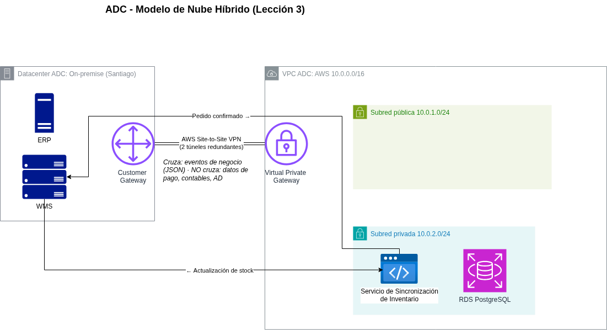

# Informe Técnico: Lección 3 - Modelo de Nube Pública, Privada e Híbrida

## 1. Objetivo

Documentar el diseño de conectividad que materializa la decisión de
**[ADR-003](../../adr/003-modelo-nube-publica-privada-hibrida.md)**: cómo se
conecta el datacenter on-premise de ADC con la VPC en AWS, y qué límites
(de red y de datos) separan ambos entornos.

## 2. Mapeo de componentes al modelo híbrido

| Componente | Entorno | Gestionado por |
|---|---|---|
| ERP (finanzas, compras, inventario contable) | On-premise, Santiago | TI interna de ADC |
| WMS (gestión de bodega, picking físico) | On-premise, Santiago | TI interna de ADC |
| Catálogo de productos (S3, Lección 1) | AWS (nube pública) | Este proyecto |
| Base de datos transaccional (RDS, Lección 2) | AWS (nube pública) | Este proyecto |
| Servicio de sincronización de inventario | AWS (nube pública), dentro de subred privada | Este proyecto |
| Frontend de e-commerce / API de catálogo | AWS (nube pública) | Este proyecto |

## 3. Diseño de conectividad híbrida

**VPC de ADC en AWS:**
- CIDR: `10.0.0.0/16`
- Subred pública `10.0.1.0/24`: punto de entrada de internet (futuro Load
  Balancer y NAT Gateway — se detalla completamente en Lección 5).
- Subred privada `10.0.2.0/24`: aloja la base de datos transaccional (RDS)
  y el servicio de sincronización de inventario, sin ruta directa a
  internet.

**Enlace híbrido — AWS Site-to-Site VPN:**

1. Se crea un **Virtual Private Gateway (VGW)**, adjunto a la VPC de ADC.
2. Se define un **Customer Gateway (CGW)**, que representa el router de
   salida del datacenter de ADC (dirección IP pública del datacenter).
3. La **VPN Connection** entre VGW y CGW provisiona automáticamente **2
   túneles** cifrados (IPSec) sobre internet, para redundancia, si un
   túnel falla, el tráfico continúa por el segundo sin intervención manual.
4. La tabla de rutas de la subred privada se actualiza para que el tráfico
   destinado a la red on-premise de ADC (asumida como `172.16.0.0/16`)
   se enrute a través del VGW, en vez de salir por el NAT Gateway.

Este diseño sigue el patrón "anatomía de arquitectura híbrida" visto en
clase: el dato regulado permanece en el datacenter, y solo la capa que debe
escalar (catálogo, checkout) vive en la nube pública, con el enlace VPN
como único punto de integración entre ambos mundos.

## 4. Flujo de datos a través del enlace híbrido

**Cloud → On-premise (confirmación de pedido):**
1. Un pedido se paga exitosamente en la plataforma de e-commerce (AWS).
2. El servicio de sincronización de inventario envía un evento de "pedido
   confirmado" a través del túnel VPN hacia el WMS.
3. El WMS inicia el proceso físico de picking en bodega.
4. *(El mecanismo específico de mensajería asíncrona para este evento —
   colas, reintentos, desacoplamiento, se formaliza en ADR-007, Lección 7.
   Este informe solo establece que el evento viaja por el enlace híbrido,
   no el mecanismo interno de mensajería.)*

**On-premise → Cloud (actualización de stock):**
1. El WMS actualiza el nivel de stock de un producto (venta física en
   tienda, recepción de mercadería, etc.).
2. El cambio se transmite a través del túnel VPN hacia el servicio de
   sincronización de inventario en AWS.
3. El servicio actualiza el estado de disponibilidad del producto,
   consumido por el catálogo y el checkout.
4. Tolerancia definida en ADR-003: máximo 15 minutos entre el cambio real
   de stock y su reflejo en el catálogo cloud.

**Lo que nunca cruza el enlace:** datos de tarjetas/pagos (quedan
tokenizados en el proveedor de pagos y en RDS), datos contables del ERP, e
identidad corporativa (Active Directory permanece on-premise, sin
federación de identidad en el alcance de este proyecto).

## 5. Frontera de seguridad de red

- La subred privada (RDS + servicio de sincronización) **no tiene ruta a
  internet**, solo al enlace VPN y, cuando corresponda, a otros servicios
  AWS a través de VPC endpoints.
- El tráfico hacia el WMS on-premise queda restringido por Security Groups
  específicos del servicio de sincronización, ningún otro componente de la
  VPC tiene ruta directa hacia la red on-premise.
- El diseño completo de subredes públicas/privadas multi-AZ (necesario para
  la capa de cómputo que se agrega en Lecciones 4 y 5) se detalla en
  **ADR-005**; este informe solo establece el límite fundamental
  público/privado que existía antes.

## 6. Relación con otras lecciones

- **Lección 2 (Backup):** el ERP/WMS on-premise gestiona su propio backup
  de forma independiente (ya establecido), justo porque este ADR confirma
  que esos sistemas están fuera del límite de la nube pública de ADC.
- **Lección 5 (Disponibilidad de red):** construye sobre el VPC y la
  subred privada definidos acá, agregando el diseño Multi-AZ completo.
- **Lección 7 (Mensajería asíncrona):** formaliza el mecanismo interno que
  transporta los eventos de "pedido confirmado" y "actualización de stock"
  mencionados en la sección 4.