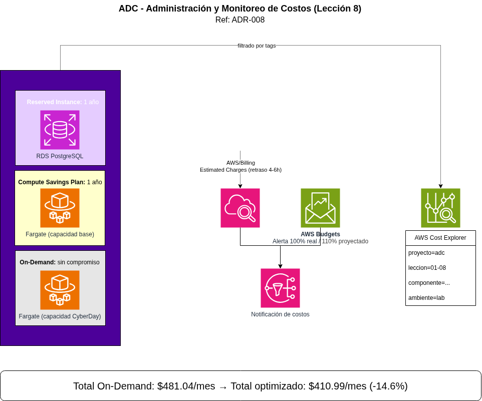
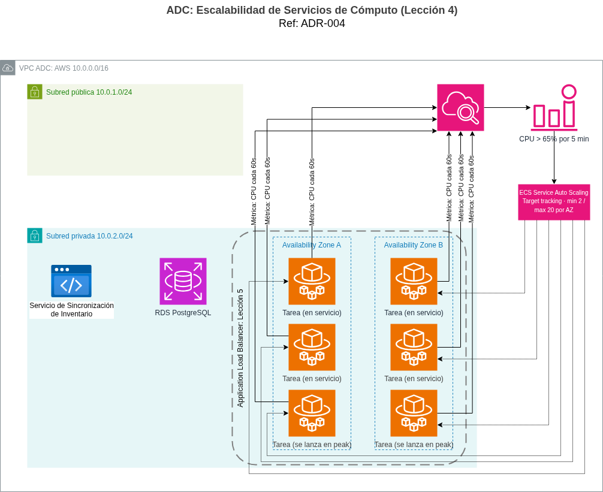

# Informe Técnico: Lección 4 - Escalabilidad de Servicios de Cómputo

## 1. Objetivo

Documentar el diseño operativo del servicio de cómputo escalable definido en
**[ADR-004](../../adr/004-auto-scaling-computo.md)**: cómo está compuesto el
servicio ECS, cómo opera el ciclo de autoescalado, y cómo se comporta
específicamente durante un evento CyberDay.

## 2. Componentes del servicio de cómputo

| Componente | Configuración |
|---|---|
| Clúster | Amazon ECS, tipo de lanzamiento **Fargate** (sin instancias EC2 que administrar) |
| Definición de tarea (Task Definition) | Contiene la imagen del contenedor de la aplicación de e-commerce (catálogo, checkout, procesamiento de pedidos) |
| Servicio ECS | Mantiene el número deseado de tareas corriendo, distribuidas entre zonas de disponibilidad |
| Política de Auto Scaling | Target tracking sobre CPU (65%), mínimo 2 / máximo 20 tareas por zona de disponibilidad |
| Registro de tráfico | Las tareas se registran ante el Load Balancer una vez que pasan el *health check* — el diseño completo del balanceador se formaliza en **ADR-005 (Lección 5)** |

## 3. Ciclo de autoescalado aplicado a ADC

Siguiendo el ciclo de 5 pasos del material de la lección (CloudWatch mide →
la alarma dispara → la política decide → el orquestador lanza → el balanceador
registra), así opera concretamente para ADC:

1. **CloudWatch mide:** recolecta el porcentaje de CPU de las tareas activas
   cada 60 segundos.
2. **La alarma dispara:** se cumple el umbral definido, CPU > 65% sostenido.
3. **La política decide:** target tracking calcula cuántas tareas adicionales
   se necesitan para volver al objetivo de 65%.
4. **ECS + Fargate lanza:** nuevas tareas arrancan en **segundos**, usando la
   misma definición de tarea (misma imagen de contenedor, misma
   configuración de red), sin intervención manual.
5. **El Load Balancer registra:** cada tarea nueva pasa su *health check*
   antes de recibir tráfico real.

**Sobre el scale-in (bajar capacidad):** el mismo ciclo opera a la inversa
cuando la CPU cae por debajo del umbral, las tareas sobrantes se retiran de
forma gradual, con un período de **cooldown** que evita que el sistema
oscile (agregar y quitar tareas repetidamente ante fluctuaciones normales de
tráfico).

## 4. Comportamiento simulado durante CyberDay

Para que la política de escalado no sea solo una configuración abstracta,
así se comporta en las tres fases de un evento CyberDay (48-72 horas):

| Fase | Tráfico relativo | Tareas activas (aprox.) | Qué ocurre |
|---|---|---|---|
| **Previo al evento** (operación normal) | 1x | 2 por AZ (mínimo configurado) | Costo base, sin sobreaprovisionamiento |
| **Inicio del pico** (primeras horas del CyberDay) | Sube rápidamente a 10-20x | Escala en escalones sucesivos, cada ciclo de ~1 minuto suma tareas | CloudWatch detecta el aumento de CPU casi de inmediato; Fargate responde en segundos por escalón, muy por debajo del margen de 2 minutos definido como SLO en ADR-004 |
| **Sostenido durante el evento** | 10-20x mantenido | Cerca del máximo configurado (20 por AZ) | La política mantiene la capacidad estable mientras la demanda no baje |
| **Fin del evento** | Vuelve gradualmente a 1x | Retorna a 2 por AZ | El cooldown evita que el sistema retire tareas de forma prematura ante una caída temporal de tráfico |

Este comportamiento es la aplicación directa de lo que el material identifica
como la diferencia entre "capacidad fija" y "autoescalado": en vez de
mantener 20 tareas por AZ los 365 días del año (sobreaprovisionamiento), o
solo 2 (subaprovisionamiento que colapsaría en CyberDay), la capacidad seguí­
la demanda real en ambas direcciones.

## 5. Por qué un solo servicio ECS (y no varios microservicios)

Tal como se documenta en ADR-004, el diseño ideal separaría catálogo,
checkout y procesamiento de pedidos en servicios ECS independientes, cada
uno escalando según su propia demanda (por ejemplo, el catálogo podría
necesitar menos escalado que el checkout durante un pico de compra). Para
este proyecto se simplifica a un único servicio ECS que agrupa la lógica de
la plataforma, documentado explícitamente como una simplificación de alcance
académico, no como la recomendación final para un ADC en producción real.

## 6. Relación con otras lecciones

- **Lección 3 (Modelo híbrido):** el servicio ECS se despliega dentro de la subred privada de la VPC
   definida en ADR-003, junto a RDS y el servicio de sincronización, sin ruta directa a internet. La subred pública, dejada intencionalmente vacía en el diagrama de la Lección 3, se completa recién en la Lección 5 con el Application Load Balancer, único componente que necesita exposición directa a internet para recibir el tráfico de los usuarios.

- **Lección 5 (Disponibilidad de red):** define el Application Load Balancer
  que distribuye tráfico hacia las tareas ECS y el diseño Multi-AZ completo
  de la capa de cómputo.
- **Lección 7 (Mensajería asíncrona):** evalúa AWS Lambda como motor para los
  eventos puntuales de integración con el WMS (descartado en ADR-004 como
  motor principal de cómputo, pero candidato natural para esa lección).