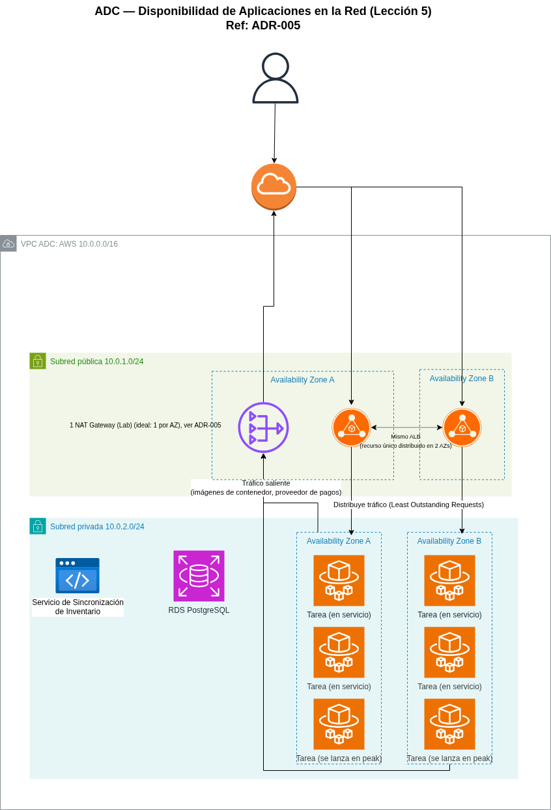

# Informe Técnico: Lección 5 - Disponibilidad de Aplicaciones en la Red

## 1. Objetivo

Completar el diseño de red de la VPC de ADC, definido parcialmente desde
ADR-003, integrando el **Application Load Balancer** y el **NAT Gateway**
definidos en **[ADR-005](../../adr/005-balanceo-carga-multi-az.md)**, y
documentar el flujo de tráfico completo — de entrada y de salida — a través
de la red.

## 2. La pieza que faltaba: Internet Gateway

Antes de detallar el ALB y el NAT Gateway, vale la pena hacer explícito un
componente que hasta ahora dimos por sentado: la VPC de ADC tiene un
**Internet Gateway (IGW)** adjunto, que es el único punto de conexión entre
la VPC y internet. Tanto el tráfico de entrada (hacia el ALB) como el de
salida (desde el NAT Gateway) pasan, en última instancia, por este mismo
componente.

- La tabla de rutas de la **subred pública** envía el tráfico `0.0.0.0/0`
  hacia el **Internet Gateway**.
- La tabla de rutas de la **subred privada** envía el tráfico `0.0.0.0/0`
  hacia el **NAT Gateway** (que vive en la subred pública), el cual a su
  vez sale a internet a través del mismo Internet Gateway.

## 3. Arquitectura de red completa

| Componente | Ubicación | Función |
|---|---|---|
| Internet Gateway | Adjunto a la VPC | Único punto de entrada/salida a internet |
| Application Load Balancer | Subred pública, ambas AZs | Recibe tráfico de usuarios, distribuye a las tareas Fargate |
| NAT Gateway | Subred pública (1 en el Lab, ideal 2) | Da salida a internet a los recursos de la subred privada |
| Target Group | — (asociado al ALB) | Lista de tareas Fargate saludables que reciben tráfico |
| Tareas Fargate | Subred privada, ambas AZs | Ejecutan la aplicación (definidas en ADR-004) |
| RDS PostgreSQL Multi-AZ | Subred privada, ambas AZs | Base de datos transaccional (definida en ADR-002) |

## 4. Configuración del Target Group y Health Checks

- **Protocolo de health check:** HTTP, sobre una ruta de verificación
  dedicada (ej. `/health`) que la aplicación debe responder con `200 OK`.
- **Intervalo:** cada 30 segundos.
- **Umbral de no saludable:** 2 verificaciones fallidas consecutivas (~60-90
  segundos totales para detectar y retirar una tarea, tal como se definió
  en la métrica de éxito de ADR-005).
- **Umbral de saludable:** 2 verificaciones exitosas consecutivas antes de
  volver a recibir tráfico (evita reincorporar una tarea que se recuperó de
  forma inestable).

Cuando el Auto Scaling Group de ADR-004 lanza una tarea nueva durante un
pico de CyberDay, esta pasa primero por este *health check* antes de
recibir tráfico real, es el mismo paso "el ELB registra" del ciclo de
autoescalado que describimos en el informe técnico de la Lección 4, ahora
con su configuración concreta.

## 5. Flujo de tráfico de entrada (usuario → aplicación)

1. El usuario accede a la plataforma de e-commerce de ADC.
2. La solicitud llega al **Application Load Balancer**, que la recibe en
   cualquiera de las dos zonas de disponibilidad.
3. El ALB evalúa el contenido de la solicitud (Capa 7) y la envía a una
   tarea Fargate saludable del Target Group, usando el algoritmo de
   **Least Outstanding Requests** definido en ADR-005.
4. La tarea Fargate procesa la solicitud, consultando RDS (datos
   transaccionales) o el catálogo (S3) según corresponda.
5. Si la tarea que recibió la solicitud se satura o falla, el ALB deja de
   enviarle tráfico automáticamente hasta que vuelva a pasar el health
   check.

## 6. Flujo de tráfico de salida (aplicación → internet)

1. Una tarea Fargate en la subred privada necesita comunicarse hacia afuera
   (ej. descargar la imagen del contenedor desde el registro, o consultar
   la API externa del proveedor de pagos).
2. La tabla de rutas de la subred privada envía ese tráfico al **NAT
   Gateway**.
3. El NAT Gateway reemplaza la IP privada de origen por su propia IP
   pública y reenvía la solicitud a través del **Internet Gateway**.
4. La respuesta regresa por el mismo camino, el NAT Gateway mantiene la
   traducción de la conexión activa.

**Importante:** este mecanismo es de **salida únicamente,** nadie desde
internet puede iniciar una conexión hacia la subred privada a través del
NAT Gateway, a diferencia del ALB, que sí acepta conexiones entrantes. Esta
asimetría es intencional y es la base de la postura de seguridad que
venimos manteniendo desde ADR-003.

## 7. Las tres capas de Multi-AZ de ADC

Vale la pena hacer explícito algo que se construyó de forma incremental a
lo largo de tres lecciones distintas, y que ahora queda completo:

| Capa | Mecanismo Multi-AZ | Definido en |
|---|---|---|
| Datos | RDS con réplica standby sincrónica | ADR-002 |
| Cómputo | Tareas Fargate distribuidas en 2 AZs con Auto Scaling | ADR-004 |
| Red | ALB distribuido en 2 AZs + NAT Gateway | ADR-005 (este informe) |

Ninguna de las tres capas depende de las otras dos para sobrevivir a la
caída de una zona de disponibilidad, es precisamente lo que el material de
esta lección describe como el objetivo de una arquitectura de alta
disponibilidad: "sin punto único de falla" en ningún nivel del stack.

## 8. Relación con otras lecciones

- **Lección 3 (Modelo híbrido):** completa la subred pública que se dejó
  vacía en ADR-003.
- **Lección 4 (Escalabilidad de cómputo):** el Target Group del ALB
  apunta directamente a las tareas Fargate definidas en ADR-004; el
  placeholder "Application Load Balancer, Lección 5" del diagrama de esa
  lección se resuelve acá.
- **Lección 6 (Disponibilidad de contenido):** el ALB maneja el tráfico
  dinámico (checkout, API); el contenido estático del catálogo se sirve por
  una ruta distinta (CloudFront), que se formaliza en la próxima lección.