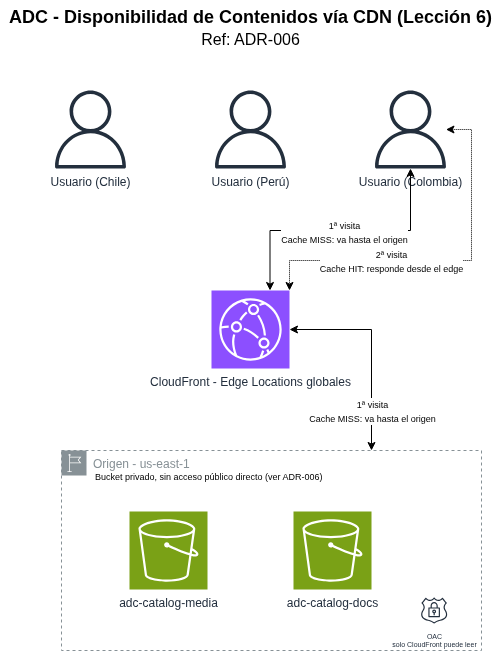

# Informe Técnico: Lección 6 - Disponibilidad de Contenidos en Cloud

## 1. Objetivo

Documentar la implementación de **CloudFront** definida en
**[ADR-006](../../adr/006-cdn-distribucion-contenido.md)**, y el cambio
concreto que esto implica en el flujo de lectura del catálogo diseñado en
la Lección 1.

## 2. Arquitectura de distribución de contenido

| Componente | Configuración |
|---|---|
| Distribución CloudFront | 1 distribución, 2 orígenes |
| Origen 1 | `adc-catalog-media` (S3), comportamiento de ruta `/media/*` |
| Origen 2 | `adc-catalog-docs` (S3), comportamiento de ruta `/docs/*` |
| Método de acceso al origen | Origin Access Control (OAC), los buckets S3 rechazan cualquier solicitud que no venga de CloudFront |
| TTL de caché por defecto | 24 horas |
| Estrategia de actualización | Cache-busting por `versionId` de S3 (no invalidación manual) |

## 3. Cambio en el flujo de lectura (vs. Lección 1)

**Antes (ADR-001, solo S3):**
1. Usuario solicita al Servicio de Catálogo una URL firmada (GET).
2. El servicio genera la URL firmada, con expiración de 15 minutos.
3. El usuario descarga el objeto directo desde S3.

**Ahora (ADR-006, con CloudFront):**
1. El Servicio de Catálogo construye la URL pública de CloudFront
   directamente (ej. `https://cdn.adc.com/media/{product_id}/{filename}?v={versionId}`),
   sin necesidad de firma ni llamada a la API de S3 para generarla.
2. El navegador solicita esa URL a CloudFront.
3. Si el Edge Location más cercano al usuario ya tiene el objeto en caché
   (y la versión coincide), lo entrega de inmediato, **sin tocar S3 en
   absoluto**.
4. Si no está en caché (primera solicitud, o versión nueva), CloudFront
   solicita el objeto al origen S3 usando OAC, lo entrega al usuario, y lo
   guarda en caché para las siguientes solicitudes en esa misma región de
   Edge.

**Lo que NO cambia:** el flujo de subida (CMS → presigned PUT → S3) definido
en ADR-001 sigue exactamente igual. Este ADR solo modifica el lado de
lectura.

## 4. Cache-busting por versión (evitar invalidaciones)

En vez de invalidar manualmente la caché de CloudFront cada vez que el CMS
actualiza una imagen (lo cual tiene costo y no es instantáneo en todos los
Edge Locations), el Servicio de Catálogo incluye el `versionId` de S3 como
parámetro de consulta en la URL — por ejemplo, algo con la forma
`https://cdn.adc.com/media/SKU-88213/imagen.jpg?v=3HL4kqCxf3v...`

Cuando el CMS sube una nueva versión del archivo (versionado activo desde
ADR-001), el `versionId` cambia, y como CloudFront trata una URL con
parámetro de consulta distinto como un objeto de caché distinto, la
próxima solicitud automáticamente golpea el origen y cachea la versión
nueva, sin necesidad de invalidar nada manualmente. El objeto viejo
simplemente expira de la caché por TTL, sin causar inconsistencia (nunca se
sirve mezclado, porque la URL de cada versión es única).

## 5. Seguridad: por qué OAC y no un bucket público

Aunque el contenido se clasificó como "público" (ADR-006), el bucket S3
**no se hace público directamente,** se mantiene privado, y solo
CloudFront (mediante OAC) tiene permiso para leerlo. La diferencia es
sutil pero importante:

- Si el bucket fuera público, cualquiera podría acceder **directo a S3**,
  saltándose CloudFront por completo — perdiendo el cacheo, la reducción de
  costo, y el control centralizado de la entrega.
- Con OAC, la **única** puerta de entrada al contenido es CloudFront — el
  bucket rechaza cualquier solicitud que no incluya la firma interna de
  OAC, sin importar que el contenido en sí sea público para los usuarios
  finales.

Es decir: "público" describe *quién puede ver el contenido* (cualquier
usuario, sin autenticación), no *cómo se accede a la infraestructura,* esa
sigue controlada.

## 6. Relación con otras lecciones

- **Lección 1 (Almacenamiento de objetos):** este informe reemplaza el
  paso 4-5 del flujo de lectura documentado ahí; el flujo de subida
  (pasos 1-3) permanece sin cambios.
- **Lección 5 (Disponibilidad de red):** el patrón de enrutamiento por ruta
  (`/media/*`, `/docs/*`) reutiliza la misma lógica de Capa 7 aplicada al
  ALB en ADR-005, esta vez a nivel de CDN en vez de balanceador de tráfico
  dinámico.