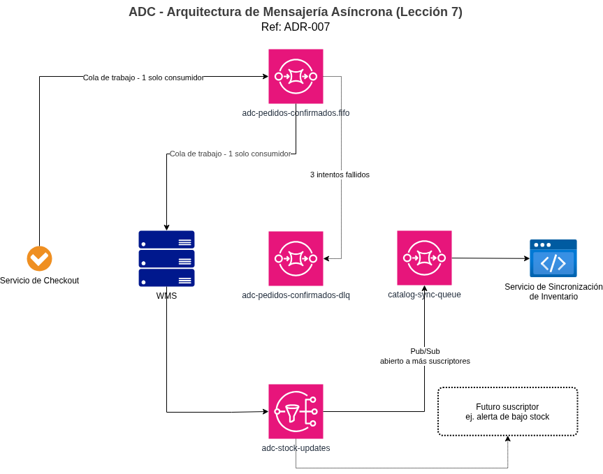

# Informe Técnico: Lección 7 - Arquitecturas Orientadas a Mensajes

## 1. Objetivo

Documentar la implementación concreta de los dos mecanismos de mensajería
definidos en **[ADR-007](../../adr/007-mensajeria-asincrona-colas.md)**, y
cómo se comportan ante escenarios de falla, que es, en la práctica, la
razón de ser de la mensajería asíncrona.

## 2. Mecanismo 1: "Pedido confirmado" (cola de trabajo, SQS FIFO)

| Componente | Configuración |
|---|---|
| Cola | `adc-pedidos-confirmados.fifo` |
| Tipo | SQS FIFO |
| MessageGroupId | `order_id` del pedido |
| Deduplicación | Basada en contenido, ventana de 5 minutos |
| Visibility timeout | 30 segundos (tiempo que un consumidor tiene para procesar antes de que el mensaje vuelva a estar disponible) |
| Dead Letter Queue | `adc-pedidos-confirmados-dlq`, tras 3 intentos fallidos |

**Flujo normal:**
1. El servicio de checkout, al confirmar un pago, envía un mensaje a la
   cola con `MessageGroupId = order_id`.
2. El consumidor (listener en el WMS, del lado on-premise) recibe el
   mensaje a través del túnel VPN y lo procesa (inicia picking).
3. Al terminar exitosamente, el consumidor elimina el mensaje de la cola.

**Flujo ante falla, ¿qué pasa si el WMS no está disponible?**
1. El mensaje permanece en la cola, sin perderse, SQS lo retiene según su
   política de retención (por defecto, hasta 4 días).
2. Cuando el WMS vuelve a estar disponible, retoma el consumo desde donde
   quedó, respetando el orden por `MessageGroupId`.
3. Si el procesamiento falla repetidamente (3 veces) — por ejemplo, un
   error de datos en el mensaje mismo, no de disponibilidad — el mensaje se
   mueve a la DLQ para revisión manual, en vez de reintentarse
   indefinidamente o perderse.

**Por qué FIFO y no Standard, en la práctica:** con una cola Standard, si
el WMS procesara dos pedidos casi simultáneos, no hay garantía de que se
procesen en el mismo orden en que se generaron, ni protección nativa contra
un reintento que genere un duplicado. Con FIFO y `MessageGroupId = order_id`,
los mensajes de un mismo pedido siempre se procesan en orden y sin
duplicados, mientras que pedidos de *distintos* clientes sí se procesan en
paralelo (grupos distintos no se bloquean entre sí), sin sacrificar
throughput.

## 3. Mecanismo 2: "Actualización de stock" (pub/sub, SNS + SQS)

| Componente | Configuración |
|---|---|
| Topic | `adc-stock-updates` |
| Tipo | Amazon SNS |
| Suscriptor actual | Cola SQS `catalog-sync-queue`, consumida por el Servicio de Sincronización de Inventario |

**Flujo normal:**
1. El WMS publica un evento de cambio de stock al topic SNS.
2. SNS distribuye automáticamente el mensaje a todas las colas suscritas
   (hoy, solo `catalog-sync-queue`).
3. El Servicio de Sincronización consume el mensaje y actualiza la
   disponibilidad del producto en el catálogo/checkout.

**Por qué SNS y no publicar directo a la cola:** si en el futuro ADC quiere
agregar, por ejemplo, un servicio de alertas de bajo stock, solo hay que
suscribir una nueva cola SQS al mismo topic, **el WMS (productor) no se
entera ni se modifica**. Publicar directo a `catalog-sync-queue` obligaría a
que el WMS conociera y escribiera a cada nuevo consumidor individualmente,
acoplando al productor con el crecimiento futuro del sistema — justo lo que
la mensajería asíncrona busca evitar.

## 4. Monitoreo operativo

Ambos mecanismos exponen la métrica `ApproximateAgeOfOldestMessage` a
CloudWatch. Una alarma se dispara si supera los **5 minutos** definidos en
ADR-007, una señal de que el consumidor correspondiente (WMS o Servicio de
Sincronización) dejó de procesar al ritmo esperado, sin necesidad de
esperar a que un cliente reporte un problema.

## 5. Relación con otras lecciones

- **Lección 3 (Modelo híbrido):** este informe formaliza el mecanismo
  interno que ADR-003 dejó pendiente para los dos eventos que cruzan el
  enlace VPN.
- **Lección 4 (Escalabilidad de cómputo):** el material de esta lección
  describe un patrón alternativo (Auto Scaling reactivo a profundidad de
  cola SQS). ADC no lo adopta, ADR-004 ya define el escalado de Fargate
  en base a CPU, que es la métrica correcta para la capa de cómputo web;
  la cola de esta lección tiene un propósito distinto (integración con el
  WMS, no absorber tráfico de usuarios).